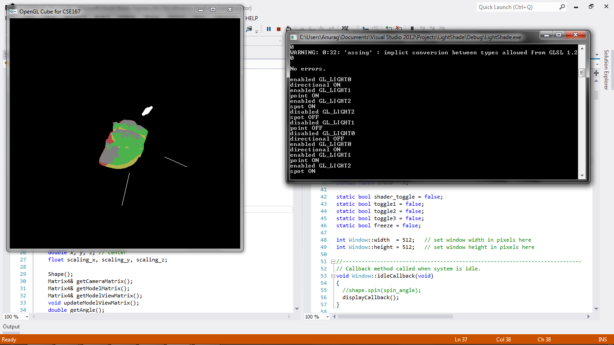

CSE 167 - Introduction to Computer Graphics
Project 4: Light and Shade
==========

(See full project specifications here: http://ivl.calit2.net/wiki/index.php/Project4Fall13)

Renders white objects (some from given .obj files) with a specified material and 3 lights. Objects can also be rotated and scaled using the mouse. Freeze mode will enable the mouse to rotate and scale the light sources instead of the object. Upon pressing '5', the GLSL vertex and fragment shaders will be toggled, causing some vertices to change and some triangles to change color. See below for full specs. Objects can also be translated, rotated, and scaled using keyboard keys as in cube.

Objects:
* F1: cube
* F2: dragon
* F3: bunny
* F4: sandal
* F8: house (view1)
* F9: house (view2)

Mouse:
* left-click: Rotate object using ```trackballRotation``` in ```Shape.cpp```
* right-click: Scale object

Lights:
* 1: Red directional light rotating around x-axis (direction represented by white line segment).
* 2: Green point light rotating around z-axis (point represented by white sphere).
* 3: Blue spot light rotating around y-axis (point and direction represented by white line segment).

Freeze Mode:
* m: Toggle freeze mode

When in freeze mode, right-clicking mouse will rotate the lights instead of the object, and left-clicking will scale the light sources (when applicable). Disable freeze mode to update light sources and illuminate at new position/direction.

Shaders:
* 5: Toggle shader mode

When in shader mode:
* The directional light should repulse the vertices, and do not cause a color shift.
* The point light should repulse the vertices as well, and shift their color towards red.
* The spot light should attract the vertices, but only if they fall within its spot, and shift their color towards green.

Note: When shading is enabled with multiple lights, the line segments and sphere used to draw the representation of the light will warp due to the shader manipulating the vertices. It only affects the drawn shape and does not affect the actual light source.


Sandal with all 3 lights enabled with no shading.


Sandal with all 3 lights enabled with shading.

