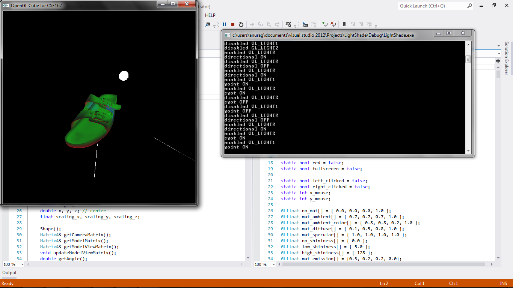

CSE 167 - Introduction to Computer Graphics
Project 4: lightshade
==========

(See full project specifications here: http://ivl.calit2.net/wiki/index.php/Project4Fall13)

Renders white objects (some from given .obj files) with a specified material and 3 lights.
Objects can also be rotated and scaled using the mouse.
Freeze mode will enable the mouse to rotate and scale the light sources instead of the object.
Objects can also be translated, rotated, and scaled using keyboard keys as in cube.

Objects:
* F1: cube
* F2: dragon
* F3: bunny
* F4: sandal
* F8: house (view1)
* F9: house (view2)

Mouse:
* left-click: rotate object using trackballRotation method
* right-click: scale object

Lights:
* 1: red directional light rotating around x-axis (direction represented by white line segment)
* 2: green point light rotating around z-axis (point represented by white sphere)
* 3: blue spot light rotating around y-axis (point and direction represented by white line segment)

Freeze Mode:
* m: toggle freeze mode
When in freeze mode, right-clicking mouse will rotate the lights instead of the object, and left-clicking will scale the light sources (when applicable). Disable freeze mode to update light sources and illuminate at new position/direction.

